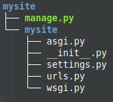
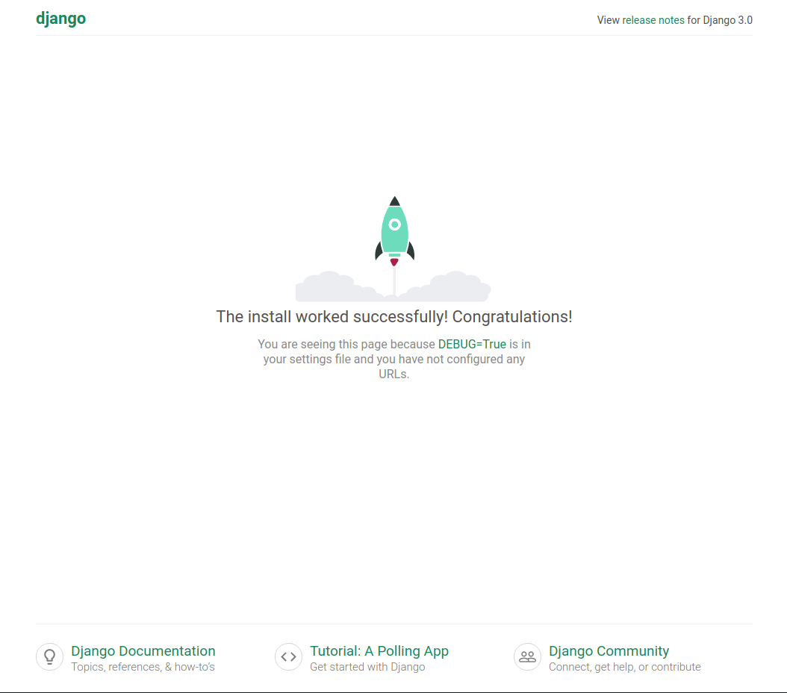
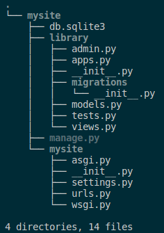
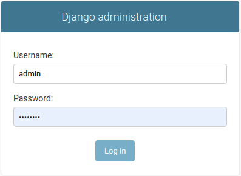

## Įžanga

Django yra internetinių puslapių ir programų framework'as. Pasižymi tokiomis savybėmis:

* Greitis - geba tvarkytis su labai daug užklausų per sekundę.
* Išplečiamumas (scalability) - ateityje savo programai galėsite nesunkiai pridėti papildomo funkcionalumo, kitaip tariant leidžia programai augti.
* Saugumas - orientuotas į saugumą. Jeigu Flask leidžia jums daryti, ką norite, django aplinkoje susidursite su apribojimais, jeigu jūsų sumanymas nesaugus.
* Batteries included - django turi praktiškai viską, ko gali prireikti standartinei web aplikacijai. Pvz. administratoriaus panelę.
* Populiarumas - pats populiariausias Python web kūrimo įrankis. Užstrigus procese, labai tikėtina, kad rasite savo problemos sprendimą internete.
* Puikiai dokumentuotas - dokumentacijas anksčiau ar vėliau teks pradėti skaityti, django atveju tai bus žymiai maloniau, negu kad pvz Odoo :)
* Turbūt pagrindinis - greitas rezultatas (rapid development). Pramokus django, web projektus darysite greitai.

Atkreipkite dėmesį, Django 3.0 palaiko Python 3.6, 3.7, and 3.8 versijas. Django neveiks, jeigu banmdysite naudoti su ankstesne už 3.6 python versija. Instaliacija:

```bash
$ pip install django
Collecting django
  Downloading https://files.pythonhosted.org/packages/a9/4f/8a247eee2958529a6a805d38fbacd9764fd566462fa0016aa2a2947ab2a6/Django-3.0.5-py3-none-any.whl (7.5MB)
    100% |████████████████████████████████| 7.5MB 246kB/s 
Collecting asgiref~=3.2 (from django)
  Downloading https://files.pythonhosted.org/packages/68/00/25013f7310a56d17e1ab6fd885d5c1f216b7123b550d295c93f8e29d372a/asgiref-3.2.7-py2.py3-none-any.whl
Collecting pytz (from django)
  Downloading https://files.pythonhosted.org/packages/e7/f9/f0b53f88060247251bf481fa6ea62cd0d25bf1b11a87888e53ce5b7c8ad2/pytz-2019.3-py2.py3-none-any.whl (509kB)
    100% |████████████████████████████████| 512kB 2.5MB/s 
Collecting sqlparse>=0.2.2 (from django)
  Downloading https://files.pythonhosted.org/packages/85/ee/6e821932f413a5c4b76be9c5936e313e4fc626b33f16e027866e1d60f588/sqlparse-0.3.1-py2.py3-none-any.whl (40kB)
    100% |████████████████████████████████| 40kB 6.8MB/s 
Installing collected packages: asgiref, pytz, sqlparse, django
Successfully installed asgiref-3.2.7 django-3.0.5 pytz-2019.3 sqlparse-0.3.1
```

pirmą kartą naudodami django turėsite pasirūpinti pradinio karkaso inicijavimu (initial setup): 

```bash 
$ django-admin startproject mysite
```

konsolėje nieko nįvyko, tačiau atkreipkite dėmesį, kad ten kur iniciavote komandą, atsirado katalogas mysite. Čia gulės mūsų projektas. Jis turi tokią struktūrą:



* manage.py - pagrindinis komandinės eilutės failas, per jį savo projektui siųsime įvairias komandas susijusias su serverio paleidimu, migracijomis ir t.t.

* asgi.py ir wsgi.py - šie failai bus naudingi talpinant gatavą projektą į linux serverį.

* __init__.py - tuščias failas, kuris nurodo python'ui, kad katalogas /mysite(vidinis) yra modulis, ir su juo reikia elgtis atitinkamai.

* settings.py - pagrindinis projekto nustatymų puslapis.
* urls.py - jame bus surašyti URL adresai (endpoints).


Mūsų projektas jau veikia lokaliame serveryje:

```bash
$ python manage.py runserver
Watching for file changes with StatReloader
Performing system checks...

System check identified no issues (0 silenced).

You have 17 unapplied migration(s). Your project may not work properly until you apply the migrations for app(s): admin, auth, contenttypes, sessions.
Run 'python manage.py migrate' to apply them.

April 06, 2020 - 17:50:02
Django version 3.0.5, using settings 'mysite.settings'
Starting development server at http://127.0.0.1:8000/
Quit the server with CONTROL-C.
```

Pirmą kartą panaudojome manage.py :)
Django startinis pulspis atrodo taip:



Vienas iš django "neprivalumų" - palyginti didelė failų struktūra, kurią reikia suprasti ir tvarkingai dėliotis nuo pat projekto pradžios. Jeigu Flask'as leidžia turėti viską viename faile, su django tokie dalykai neišdegs. Šis kompromisas neišvengiamas, norint greitai daryti didelės apimties projektus. Ir tai ne paskutinė vieta, kur susidursite su django laisvės suvaržymais.

Taigi, vietoje firminės užsklandos norime matyti kažką savo, gražesnio. Susikurkime app'są!

```bash
$ python manage.py startapp library
```

Taigi, dabar turime projektą mysite, o jame app'są library. Vienas projektas gali turėti daug app'sų. Failų struktūra dabar atrodo taip:



Kiekvieno failo paskirtį išsiaiškinsime eigoje.

Faile views.py sukurkime tokį įrašą:

```python
from django.http import HttpResponse

def index(request):
    return HttpResponse("Labas, pasauli!")
```


Kataloge /library sukurkime urls.py:

```python
from django.urls import path

from . import views

urlpatterns = [
    path('', views.index, name='index'),
]
```

Taigi, prie standartinio *path* importuojame failą views.py, kurį rašėme prieš tai. Į sąrašą *urlpatterns* dedame iš django.urls importuotą funkciją path, kurios parametruose nurodome:

* tuščias kabutes - vadinasi response gausime mūsų app'so reliatyviame adrese (endpoint'e) '/'.
* *views.index* - nurodome, kad funkcija, kuri mums grąžins *HttpResponse("Labas, pasauli!")* yra faile *views* ir ji vadinasi *index*.
* *name='index'* - suteikiame pavdinimą šiam adresui. Ateityje tai bus naudinga referuojant į jį iš šablonų (templates).

Sekantis veiksmas yra sureguliuoti, kaip mūsų app'sas atrodys projekto kontekste. Faile urls.py, kuris yra mysite kataloge, įrašykime tai:

```python
from django.contrib import admin
from django.urls import include, path

urlpatterns = [
    path('library/', include('library.urls')),
    path('admin/', admin.site.urls),
]
```

Taip pririšame app'są prie projekto. Projektas mato mūsų aplikaciją *library*,kaip modulį, tą galime nuspėti iš sintaksės. Galime kurti daug aplikacijų, ir pats centrinis modelis, ir jos pačios viena kitą matys kaip modulius. Pamėginkime paleisti serverį dar kartą:

```bash
$ python manage.py runserver
```

Užėję į 127.0.0.1:8000 matome, kad raketa dingo, vietoj jos turime klaidos pranešimą:


Django pranešimai, kuomet settings.py nustatytas *DEBUG = True* yra pakankamai informatyvūs: šią klaidą matome todėl, kad mysites urls.py yra nurodyti tik galiniai adresai *library/* ir *admin/*. Patikrinkim juos:


ir django pasididžiavimas, vienas iš batteries included komponentų, puikioji administratoriaus panelė:



...apie kurią būtinai kalbėsime ateityje :)

Tam kad visi ateityje naudojami įrankiai atpažintų mūsų aplikaciją, ją reikia užregistruoti settings.py:

```python
INSTALLED_APPS = [
    'django.contrib.admin',
    'django.contrib.auth',
    'django.contrib.contenttypes',
    'django.contrib.sessions',
    'django.contrib.messages',
    'django.contrib.staticfiles',
    'library'
]
```

Kol kas neturime jokių duomenų bazės modelių, tačiau django jau susikūrė keletą lentelių vidiniam vartojimui, todėl reikia praleisti migracijas:

```bash
$ python manage.py makemigrations
$ python manage.py migrate
```

# Rajono biblioteka

Tai bus projektas, kuris bus jums kaip pavyzdys, kaip veikia django sistema. Jame nebūtinai bus viskas labai logiška. Pvz., jeigu tarkime, prireiks kažkokio komponento, kuris projektui nebūtinas, bet mokymosi procesui naudingas, mes jį įterpsime. 

Dizainas - su django visiškai nesusijusi tema, todėl bus vietų, atrodančių kiek grubokai. Sekdami šį, ar darydami savo projektą, turėsite pasirūpinti frontendu pagal savo estetikos supratimą. Projekto eigoje bus įjungtas paprasčiausias Bootstrap CSS karkasas.

Projektas bus apie vietinę biblioteką, kurioje bus modeliai knyga, autorius, apžvalga, komentaras, ir pan. Bus vartotojų registracija ir prisijungimai, formos ir kiti web backend'o karkasui reikalingi atributai.

Django turi keletą būdų įgyvendinti kai kurias funkcijas, jas visas stengsimės pademonstruoti, tačiau realiam gyvenime turbūt darytumėt kuriuo nors vienu, nuosekliai. 

Siekiant išvengti painumo, gatavas kodas Github repozitorijoje perskeltas pusiau - iki 6 paskaitos ir nuo jos, kadangi eigoje stipriai keisis modeliai ir kiti komponentai iš visiškai paprastų į kiek sudėtingesnius.

Taip pat reikėtų suprasti, kad Django yra labai plati tema (apimtis turbūt panaši kaip visos python kalbos), todėl nepamirškite draugų stackoverflow, dokumentacijos ir kitų:) Sėkmės!


