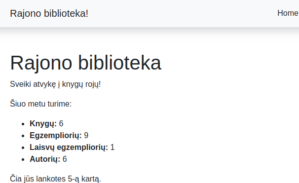
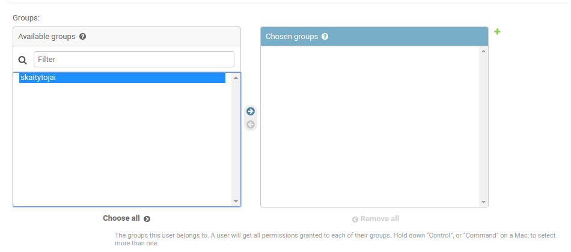
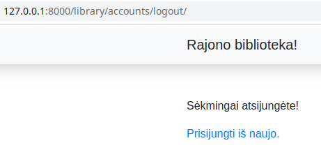

# Sesijos

Ryšys tarp naršyklės ir serverio vyksta per HTTP protokolą, kuris neįsimena būsenos (yra *stateless*). Tai, kad protokolas *stateless*, reiškia, kad pranešimai tarp kliento ir serverio yra visiškai nepriklausomi vienas nuo kito - nėra veiksmų sekos ar elgesio, pagrįsto ankstesniais pranešimais. Dėl to, jei norite turėti svetainę, kurioje būtų sekama vykstanti sąveika su klientu, turite tai įgyvendinti patys.

**Sesijos** yra Django (ir ne tik) įrankis, padedantis sekti būseną (*state*) kurioje yra serverio ir kliento ryšys. Sesijos, padeda išsaugoti kiekvienam prisijungimui būdingą informaciją ir ją atgaminti, sulaukus prisijungimo iš tos pačios naršyklės. Supaprastintai žiūrint - Django suteikia kiekvienai naršyklei identifikacinį numerį, pagal kurį paskui atsirenka, kokią personalizuotą informaciją jam pateikti. 

Django numatytas būdas saugoti sesijų informaciją yra toje pačioje duomenų bazėje. Tai yra saugesnis būdas, negu tą daryti naršyklės 'sausainiukuose'. Django leidžia mums patiems apsispręsti, kur saugosime sesijas, galime pasitelkti dar kitą saugojimo vietą, pvz Redis. Panagrinėkime paprasčiausią pavyzdį - apsilankymų skaičiaus fiksavimą.

faile *views.py* perrašykime funkciją *index:*

```python
def index(request):
    num_books = Book.objects.all().count()
    num_instances = BookInstance.objects.all().count()
    num_instances_available = BookInstance.objects.filter(status__exact='g').count()
    num_authors = Author.objects.count()
    
    # Papildome kintamuoju num_visits, įkeliame jį į kontekstą.
    
    num_visits = request.session.get('num_visits', 1)
    request.session['num_visits'] = num_visits + 1
    context = {
        'num_books': num_books,
        'num_instances': num_instances,
        'num_instances_available': num_instances_available,
        'num_authors': num_authors,
        'num_visits': num_visits,
    }
    return render(request, 'index.html', context=context
```

* nustatome sesijos 'num_visits' rakto reikšmę 1, jeigu ji nebuvo nustatyta prieš tai.
* kaskartą sužadinus funkciją *index*, reikšmė paauga vienetu.

išveskime rezultatą į naršyklę. *index.html* pabaigoje pridėkime eilutę:

```html
<p>Čia jūs lankotes {{ num_visits }}-ą kartą.</p>
```



kaskartą perkrovus puslapį, skaičius paauga. Jeigu pabandytumėt užeiti iš kitos naršyklės, kad ir tame pačiame kompiuteryje, matytumėt kitą skaičių. Tokiu būdu sesijos leidžia kaupti informaciją apie anoniminius vartotojus. 

# Vartotojai, prisijungimas, atsijungimas, slaptažodžio keitimas

Sesijų pagrindu sukurta visa django autentifikacijos ir autorizacijos sistema. Autentifikacijos sistema įjungiama automatiškai, inicijavus projektą (kuomet leidome komandą *django-admin startproject*), todėl papildomai jokių nustatymų daryti nereikės. Duomenų bazė jau paruošta vartotojų kūrimui nuo pat pirmosios migracijos. Užregistruokime bibliotekai skaitytojų!

Pradėsime nuo grupės 'skaitytojai' sukūrimo. Administratoriaus svetainėje užeikime į 'Groups', įveskime pavadinimą skaitytojai ir spauskime save:


Tuomet sukurkime vartotoją, įveskime *username*, slaptažodį ir *save*. Tuomet pakliūsime į detalią vartotojo aprašymo anketą. Paskrolinkime žemyn, ir surasime grupę *Permissions*, uždėkime varnelę prie *Active*, tada dar kiek žemiau galime mūsų vartotoją priskirti grupei:



pabaigoje rasime *'save'*, jį ir paspauskime.

Į Django integruota visa autentifikacijos sistema - URL mapper'iai, formos, *views'ai*. Tik templates teks susikurti patiems.

Pradėkime nuo *urls.py*. Pridėkime:
```python
from django.urls import path, include

urlpatterns += [
    path('accounts/', include('django.contrib.auth.urls')),
]
```

pridėję šį vienintelį narį prie *urlpatterns* sąrašo, realiai gauname visą puokštę naudingų *endpoint*'ų, su gatava už jų esančia logika:

```python
accounts/ login/ [name='login']
accounts/ logout/ [name='logout']
accounts/ password_change/ [name='password_change']
accounts/ password_change/done/ [name='password_change_done']
accounts/ password_reset/ [name='password_reset']
accounts/ password_reset/done/ [name='password_reset_done']
accounts/ reset/<uidb64>/<token>/ [name='password_reset_confirm']
accounts/ reset/done/ [name='password_reset_complete']
```

jeigu pabandytumėm aplankyti http://127.0.0.1:8000/library/accounts/login/, gautumėm klaidą, kad trūksta *template*'o:

```
...
Exception Type:	TemplateDoesNotExist
Exception Value: registration/login.html
...
```
Ši klaida mums sufleruoja, kur ir kokio failo ieško django. *T*emplates* kataloge sukurkime katalogą *registration*, o jame failą *login.html*.

```html




  
    <p>Prisijungimo klaida, bandykite dar kartą!</p>
  
  
  
    
      <p>Neturite prieigos prie šiopassword_reset_email.html turite prisijungti.</p>
    
  
  
  <form method="post" action="">
    
    <table>
      <tr>
        <td>Vartotojas: </td>
        <td>{{ form.username }}</td>
      </tr>
      <tr>
        <td>Slaptažodis: </td>
        <td>{{ form.password }}</td>
      </tr>
    </table>
    <input type="submit" value="Prisijungti" />
    <input type="hidden" name="next" value="{{ next }}" />
  </form>
  
  <p><a href="">Pamiršote slaptažodį?</a></p>
  

```


Django daro prielaidą, kad mus reikia nukrepti į */profile* puslapį, kurio mes neturime ir nežadame turėti.

pakeiskime tai, *settings.py* pridėję eilutę:

```python
LOGIN_REDIRECT_URL = '/'
```

sukurkime logout logged_out.html:

```html



  <p>Sėkmingai atsijungėte!</p>  
  <a href="">Prisijungti iš naujo.</a>

```



minimalus šablonų kiekis parašytas. Taip pat autentifikacijai reikalingi slaptažodžio keitimo mechanizmai. Šablonus jiems galima perrašyti patiems, tačiau iš pradžių naudosime django standartinius. Taip pat, keičiant slaptažodį reikia, kad django galėtų siųsti laiškus. Į settings.py įrašykime :

```python
EMAIL_BACKEND = 'django.core.mail.backends.console.EmailBackend'
EMAIL_HOST = 'smtp.gmail.com'
EMAIL_POST = 587
EMAIL_USE_TLS = True
EMAIL_HOST_USER = 'mano_pastas@gmail.com'
# el. pašto adresas iš kurio siųsite
EMAIL_HOST_PASSWORD = 'VerySecret'
# slaptažodis
```

konsolėje įsitikiname (paspaudę slaptažodžio keitimo nurodą login puslapyje), kad laiškas išsiųstas:

```bash
Content-Type: text/plain; charset="utf-8"
MIME-Version: 1.0
Content-Transfer-Encoding: 8bit
Subject: Password reset on 127.0.0.1:8000
From: webmaster@localhost
To: kazkoks@gmail.com
Date: Sun, 03 May 2020 05:14:02 -0000
Message-ID: <158848284239.10953.4443384062472229894@robotautas-MS-7A34>


You're receiving this email because you requested a password reset for your user account at 127.0.0.1:8000.

Please go to the following page and choose a new password:

http://127.0.0.1:8000/library/accounts/reset/Mw/5g6-74f21ac863abc984b457/

Your username, in case you’ve forgotten: skaitytojas

Thanks for using our site!

The 127.0.0.1:8000 team
```


Ši konfigūracija yra *development only*, todėl realių laiškų kol kas nesiųs, tačiau konsolėje gautas įrašas rodo, kad nustatymai veikia.  

Anksčiau minėjau, kad galima perrašyti standartinius django slaptažodžių priminimo šablonus. Jeigu norėsite slaptažodžių keitime turėti savo dizainą ir galbūt kažkokios papildomos logikos, reikės perrašyti django numatytuosius šablonus (pavyzdžiai su minimaliu dizainu):

/templates/registration/password_reset_form.html:

```html



  <form action="" method="post">
  
  
    {{ form.email.errors }}
  
      <p>{{ form.email }}</p> 
    <input type="submit" class="btn btn-default btn-lg" value="Reset password">
  </form>

```

/templates/registration/password_reset_done.html:

```html



  <p>Slaptažodžio pakeitimo nuorodą išsiuntėme jums el.paštu!</p>

```

LAIŠKO TURINYS! /templates/registration/password_reset_email.html:

```html
Kažkas mums atsiuntė užklausą slaptažodio keitimui. Jeigu tai buvote Jūs, sekite nuoroda žemiau:
{{ protocol}}://{{ domain }}
```

/templates/registration/password_reset_confirm.html:

```html



    
        <p>Įveskite naują slaptažodį ir pakartokite.</p>
        <form action="" method="post">
        
            <table>
                <tr>
                    <td>{{ form.new_password1.errors }}
                        <label for="id_new_password1">Naujas slaptažodis:</label></td>
                    <td>{{ form.new_password1 }}</td>
                </tr>
                <tr>
                    <td>{{ form.new_password2.errors }}
                        <label for="id_new_password2">Patvirtinkite:</label></td>
                    <td>{{ form.new_password2 }}</td>
                </tr>
                <tr>
                    <td></td>
                    <td><input type="submit" value="Pakeisti slaptažodį" /></td>
                </tr>
            </table>
        </form>
    
        <h1>Nepavyko pakeisti slaptažodžio</h1>
        <p>Slaptažodžio pakeitimo nuoroda negaliojanti. Prašome inicijuoti slaptažodžio keitimą iš naujo.</p>
    

```

/templates/registration/password_reset_complete.html:

```html



  <h1>Slaptažodis pakeistas!</h1>
  <p><a href="">prisijungti iš naujo</a></p>

```

Atkreipkite dėmesį, kad tam, kad django administraciniai puslapiai naudotų mūsų html puslapius (įdėtus į registration katalogą), reikia, kad settings.py faile mūsų appsas būtų virš visų kitų:

```python
INSTALLED_APPS = [
    'library',
    'django.contrib.admin',
    'django.contrib.auth',
    'django.contrib.contenttypes',
    'django.contrib.sessions',
    'django.contrib.messages',
    'django.contrib.staticfiles',
]
```

Įsitikinkime, kad veikia. Paspaudus slaptažodžio priminimo nuorodą, įvedėme el. paštą, konsolėje pasiėmėme laiško nuorodą, perkopijavome į naršyklės url lauką. Matome rezultatą:


slaptažodį pavyko pakeisti.

 ## Užduotis
Tęsti kurti Django užduotį – [Autoservisas](https://github.com/robotautas/kursas/wiki/Django-u%C5%BEduotis:-Autoservisas):
* Padaryti, kad pagrindiniame puslapyje būtų rodomas sesijos apsilankymų skaičius.
* Padaryti login puslapį, per kurį leistų prisijungti vartotojui.
* Jei reikia, perdaryti base.html meniu, kad prisijungimo punkto nerodytų prisijungus, atsijungimo atsijungus ir pan.
* Susikonfiguruoti el. paštą slaptažodžio keitimui.
* Susikurti savo siunčiamo el. laiško šabloną (keičiant slaptažodį).
* Pakeisti visus administracinius slaptažodžio keitimo puslapius savo formomis (kaip šios paskaitos medžiagoje).

[Atsakymas](https://github.com/DonatasNoreika/autoservisas)
