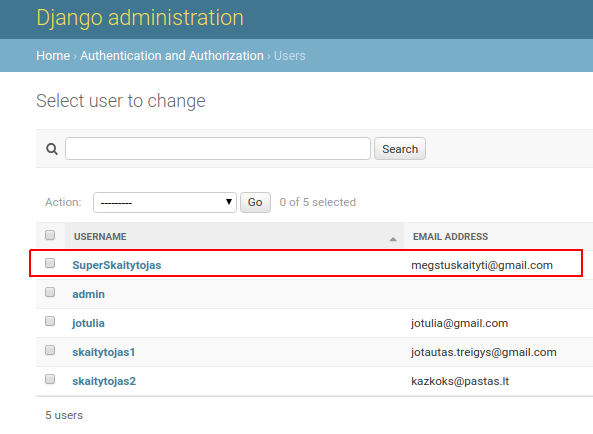
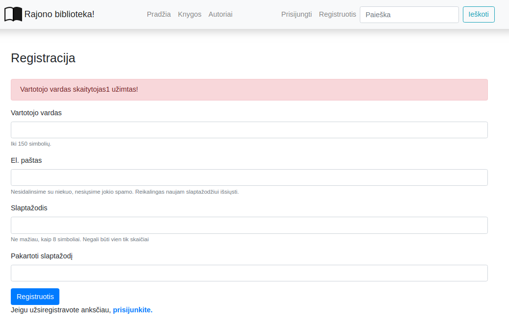

# Formos

Formos gali būti komplikuotos, dažnai iš pirmo karto ir neišeiti :) Šį kartą formas bandysime įsisavinti per mūsų pavyzdžiui nebūtiną, bet mokymosi tikslams tinkamą naujo vartotojo registracijos procesą.

Pradėkime nuo šablono *register.html* sukūrimo:

```html




    <div class="container register">
        <h3>Registracija</h3><br/>
        <form method="post">
            
            <div class="form-group">
                <label for="username">Vartotojo vardas</label>
                <input name="username" type="text" class="form-control" id="username" aria-describedby="usernameHelp">
                <small id="usernameHelp" class="form-text text-muted">Iki 150 simbolių.</small>
            </div>
            <div class="form-group">
                <label for="exampleInputEmail1">El. paštas</label>
                <input name="email" type="email" class="form-control" id="exampleInputEmail1" aria-describedby="emailHelp">
                <small id="emailHelp" class="form-text text-muted">Nesidalinsime su niekuo, nesiųsime jokio spamo.
                    Reikalingas naujam slaptažodžiui išsiųsti. </small>
            </div>
            <div class="form-group">
                <label for="password">Slaptažodis</label>
                <input name="password" type="password" class="form-control" id="password" aria-describedby="pwdHelp">
                <small id="pwdHelp" class="form-text text-muted">Ne mažiau, kaip 8 simboliai. Negali būti vien tik
                    skaičiai</small>
            </div>
            <div class="form-group">
                <label for="password2">Pakartoti slaptažodį</label>
                <input name="password2" type="password" class="form-control" id="password2" aria-describedby="pwd2Help">
            </div>
            <button type="submit" class="btn btn-primary register-button">Registruotis</button>
        </form>
        <p>Jeigu užsiregistravote anksčiau, <a href="/login"><strong>prisijunkite.</strong></a></p>
    </div>


```

tai tiesiog iš *bootstrap* nukopijuota ir situacijai pritaikyta forma, su vartotojo vardu, el. paštu ir dviem slaptažodžio laukais. Dar reikės sukurti *view*są. Pradžioje *views.py* pasidarykime keletą *import*ų:

```python
from django.shortcuts import redirect
from django.contrib.auth.forms import User
from django.views.decorators.csrf import csrf_protect
from django.contrib import messages
```

Ir dabar pačią registracijos funkciją:

```python
@csrf_protect
def register(request):
    if request.method == "POST":
        # pasiimame reikšmes iš registracijos formos
        username = request.POST['username']
        email = request.POST['email']
        password = request.POST['password']
        password2 = request.POST['password2']
        # tikriname, ar sutampa slaptažodžiai
        if password == password2:
            # tikriname, ar neužimtas username
            if User.objects.filter(username=username).exists():
                messages.error(request, f'Vartotojo vardas {username} užimtas!')
                return redirect('register')
            else:
                # tikriname, ar nėra tokio pat email
                if User.objects.filter(email=email).exists():
                    messages.error(request, f'Vartotojas su el. paštu {email} jau užregistruotas!')
                    return redirect('register')
                else:
                    # jeigu viskas tvarkoje, sukuriame naują vartotoją
                    User.objects.create_user(username=username, email=email, password=password)
        else:
            messages.error(request, 'Slaptažodžiai nesutampa!')
            return redirect('register')
    return render(request, 'register.html')
```

Šiek tiek paaiškinimų rasite kodo komentaruose.

Užregistruokime *endpoint'ą urls.py*:

```python
path('register/', views.register, name='register')
```

Taip pat, *base.html*, reikės nuorodos į registracijos formą. Iš karto po navigacijos meniu punkto "prisijungti" įterpkime:

```html

    <li class="nav-item"><a class="nav-link" href="">Registruotis</a></li>

```

Jeigu viskas pasisekė, turėsime štai tokią formą:


Pagrindinės (ne visos!) registracijos funkcijos veikia:



Nors su formomis dar nebaigėme, dabar geras metas panagrinėti django pranešimų sistemą. Jeigu pamenate, *views.py* jau importavome *messages* ir į registracijos *view*'są įterpėme šiek tiek logikos su pranešimais. Bet jie neveikia - todėl, kad jų nenurodėme šablone. Pamėginkime sutvarkyti *register.html*:

```html
        
            
                <div class="alert alert-danger" role="alert">
                    {{ message }}
                </div>
            
        
```

Turėsime tokį rezultatą:



Taip pat neveikia slaptažodžio sudėtingumo tikrinimas, savo projekte pamėginkite tikrinti slaptažodį pagal regex šabloną. Taipogi galima sėkmingos registracijos atveju nukreipti vartotoją į prisijungimo puslapį su sėkmės žinute, kad registracija pavyko ir kviečiame prisijungti. 

Pabandykime padaryti taip, kad užsiregistravęs skaitytojas galėtų palikti atiliepimą apie knygą. Pirmiausiai sukurkime atsiliepimų modelį:

```python
class BookReview(models.Model):
    book = models.ForeignKey('Book', on_delete=models.SET_NULL, null=True, blank=True)
    reviewer = models.ForeignKey(User, on_delete=models.SET_NULL, null=True, blank=True)
    date_created = models.DateTimeField(auto_now_add=True)
    content = models.CharField('Atsiliepimas', max_length=2000)
```

pridėkime į adminitratoriaus svetainę:

```python
class BookReviewAdmin(admin.ModelAdmin):
    list_display = ('book', 'date_created', 'reviewer', 'content')

admin.site.register(BookReview, BookReviewAdmin)
```

padarykime atsiliepimus matomus šablone *book_detail.html* po knygos aprašymu:

```html
</br>
  <h4>Atsiliepimai:</h4>
  
    
      <hr>
      <strong>{{ review.reviewer }}</strong>, <em>{{ review.date_created}}</em>
      <p>{{ review.content }}</p>
    
  
    <p>Knyga neturi atsiliepimų</p>
  
```

susimuliuokime atsiliepimą per administratoriaus svetainę:


dabar sukursime paprastą formą atsiliepimui. Naudosimės django integruotu būdu formoms kurti. Pirmiausia susikurkime naują failą *forms.py*:

```python
from .models import BookReview
from django import forms

class BookReviewForm(forms.ModelForm):
    class Meta:
        model = BookReview
        fields = ('content', 'book', 'reviewer',)
        widgets = {'book': forms.HiddenInput(), 'reviewer': forms.HiddenInput()}
```

Kadangi komentuoti galės tik prisijungęs vartotojas, o knyga visuomet bus ta, po kuria komentuojamama, *book* ir *reviewer* laukus paslėpėme.

Dabar perrašykime *BookDetailView*  *view*'są taip:

```python
# Importuojame FormMixin, kurį naudosime BookDetailView klasėje
from django.views.generic.edit import FormMixin

class BookDetailView(FormMixin, generic.DetailView):
    model = Book
    template_name = 'book_detail.html'
    form_class = BookReviewForm

    class Meta:
        ordering = ['title']

    # nurodome, kur atsidursime komentaro sėkmės atveju.
    def get_success_url(self):
        return reverse('book-detail', kwargs={'pk': self.object.id})
    
    # įtraukiame formą į kontekstą, inicijuojame pradinę 'book' reikšmę.
    def get_context_data(self, *args, **kwargs):
       context = super(BookDetailView, self).get_context_data(**kwargs)
       context['form'] = BookReviewForm(initial={'book': self.object})
       return context

    # standartinis post metodo perrašymas, naudojant FormMixin, galite kopijuoti tiesiai į savo projektą.
    def post(self, request, *args, **kwargs):
        self.object = self.get_object()
        form = self.get_form()
        if form.is_valid():
            return self.form_valid(form)
        else:
            return self.form_invalid(form)

    # štai čia nurodome, kad knyga bus būtent ta, po kuria komentuojame, o vartotojas bus tas, kuris yra prisijungęs.
    def form_valid(self, form):
        form.instance.book = self.object
        form.instance.reviewer = self.request.user
        form.save()
        return super(BookDetailView, self).form_valid(form)
```

čia iš karto susiduriame su situacija, kai *CBV (class based views*) parodo mažiau gražią savo pusę - *view*'sas tapo griozdiškas ir sunkiai suprantamas. Mes *override*'iname keletą funkcijų, ir turime žinoti, kaip ir kokias iš jų perrašyti. Na ir paskutiniai pakeitimai bus *book_detail.html* šablone:

```html
  
  <div class="fieldWrapper">
    <hr><br/>
    <h4>Palikite atsiliepimą:</h4>
    <form action="" method="post">
      
      {{ form.content }}</br>
      <input type="submit" value="Išsaugoti">
    </form>
  </div>
  
```

rezultatas:

