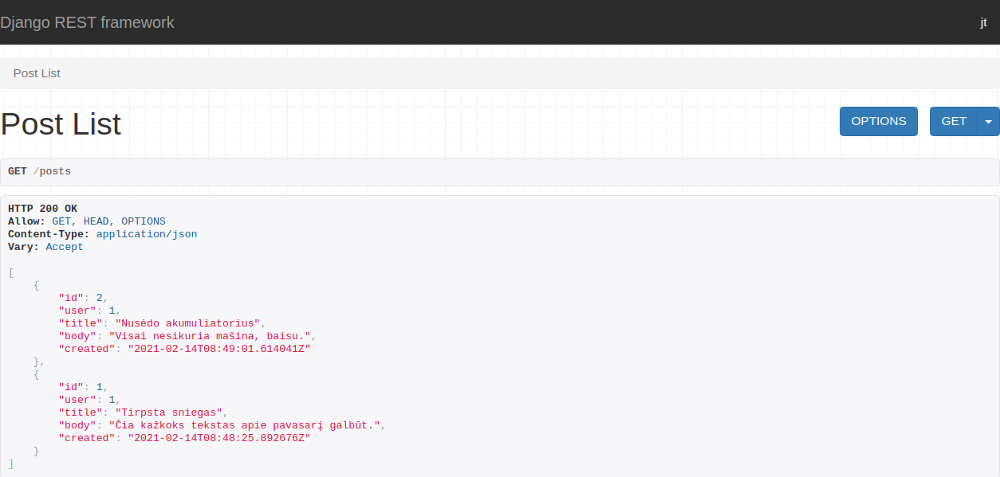
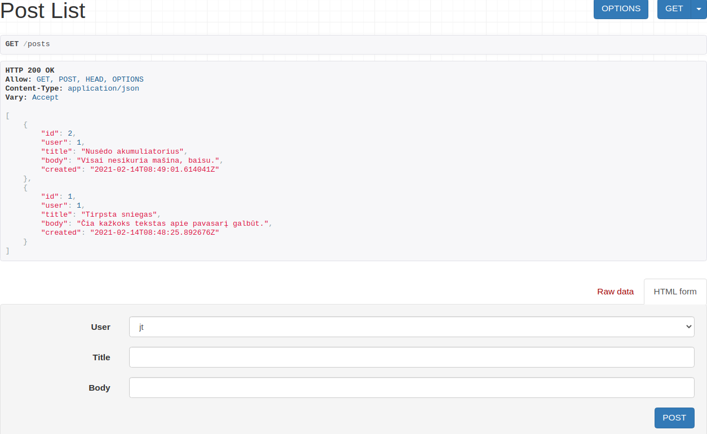
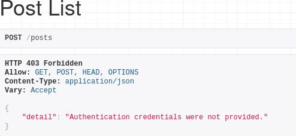

# Django Rest

[Django Rest](https://www.django-rest-framework.org/) yra karkasas, skirtas kurti API su Django. Diegiasi per pip:

```bash
pip install djangorestframework
```

## Pasiruošimas

susikurkime projektą:

```bash
django-admin startproject api_example
```

prie projekto prikabinkime aplikaciją *postit_api*:

```bash
python manage.py startapp postit_api
```

*settings.py* užregistruokime mūsų app'są, ir Django Rest karkasą:

```python
INSTALLED_APPS = [
    ···
    'rest_framework',
    'postit_api',
]
```

papildykime *urls.py urlpatterns* sąrašą:

```python
urlpatterns = [
    path('admin/', admin.site.urls),
    path('', include('postit_api.urls'))
]
```

models.py faile susikurkime DB modelį:

```python
from django.db import models
from django.contrib.auth.models import User


class Post(models.Model):
    title = models.CharField(max_length=150)
    body = models.CharField(max_length=2000)
    user = models.ForeignKey(User, on_delete=models.CASCADE)
    created = models.DateTimeField(auto_now_add=True)

    class Meta:
        ordering = ['-created']

class Comment(models.Model):
    post = models.ForeignKey(Post, on_delete=models.CASCADE)
    user = models.ForeignKey(User, on_delete=models.CASCADE)
    body = models.CharField(max_length=1000)
    created = models.DateTimeField(auto_now_add=True)

    class Meta:
        ordering = ['-created']

class PostLike(models.Model):
    user = models.ForeignKey(User, on_delete=models.CASCADE)
    post = models.ForeignKey(Post, on_delete=models.CASCADE)

class CommentLike(models.Model):
    user = models.ForeignKey(User, on_delete=models.CASCADE)
    comment = models.ForeignKey(Comment, on_delete=models.CASCADE)
```

Centrinė figūra mūsų modelyje bus User, kurio klasės mes nekuriame, o importuojame iš Django vidaus. Vartotojas galės kurti pranešimus, taip pat juos komentuoti, *laikinti* tiek pranešimus, tiek komentarus. Bus kažkas panašaus į skelbimų lentą, ar *reddit*, ar tinklaraštį.

makemigrations, migrate.

Užregistruokime DB modelį admin.py:

```python
from django.contrib import admin
from .models import Post, Comment, PostLike, CommentLike

admin.site.register(Post)
admin.site.register(Comment)
admin.site.register(PostLike)
admin.site.register(CommentLike)
```

susikurkime supervartotoją:

```bash
python manage.py createsuperuser
```

## Serializers

Serializatoriai pertvarko *python* objektus į JSON formatą. Tai yra serializacija. Deserializacija yra atvirkštinis procesas. Aplikacijos aplanke susikurkime serializers.py:

```python
from rest_framework import serializers
from .models import Post, Comment, CommentLike, PostLike

class PostSerializer(serializers.ModelSerializer):
    class Meta:
        model = Post
        fields = ['id', 'user', 'title', 'body', 'created']
```

kol kas tegu būna tik viena klasė. Sekantis žingsnis - sukurti *views*:

```python
from django.shortcuts import render
from rest_framework import generics
from .models import Post, PostLike, Comment, CommentLike
from .serializers import PostSerializer

class PostList(generics.ListAPIView):
    queryset = Post.objects.all()
    serializer_class = PostSerializer
```

kintamajam queryset priskyrėme visus Post klasėje esančius objektus, taip pat nurodėme, kokį *serializer'į* naudosime.

aplikacijos kataloge sutvarkykime *urls.py*:

```python
from django.urls import path, include
from .views import PostList

urlpatterns = [
    path('posts', PostList.as_view()),
]
```
įtraukime aplikacijos postit_api urlpattern'us į projekto lygyje esantį *urls.py*:
```python
from django.contrib import admin
from django.urls import path, include

urlpatterns = [
    path('admin/', admin.site.urls),
    path('', include('postit_api.urls'))
]
```

sukurkime porą post'ų per administratoriaus prieigą, išbandykime :)



Turime veikiantį API su GET metodu. DRF supranta, kad į API einame per svetainę, todėl grąžina mums atsakymą su gražiu interfeisu, per kurį mes galime testuoti, kaip veikia. Duomenis galime pasiekti ir per konsolę(curl, httpie), specialius įrankius API testavimui - tokius, kaip Postman, taip pat per bet kokią programavimo kalbą (na, beveik per bet kokią :)).

tarkime:

```bash
jt@jt-MS-7A34:~/Desktop$ curl 'http://127.0.0.1:8000/posts'
[{"id":2,"user":1,"title":"Nusėdo akumuliatorius","body":"Visai nesikuria mašina, baisu.","created":"2021-02-14T08:49:01.614041Z"},{"id":1,"user":1,"title":"Tirpsta sniegas","body":"Čia kažkoks tekstas apie pavasarį galbūt.","created":"2021-02-14T08:48:25.892676Z"}]
```

Kol kas mūsų API palaiko tik GET metodą. Jeigu norime POST metodo, turime pakoreguoti paveldėjimą *PostList* klasėje:

```python
class PostList(generics.ListCreateAPIView):
    queryset = Post.objects.all()
    serializer_class = PostSerializer
```


Dabar turime situaciją, kai bet koks vartotojas gali nustatyti, koks vartotojas paskelbė įrašą, tačiau norėtųsi, kad įrašai skelbtųsi tik skelbiančiojo vartotojo vardu. Turime pakoreguoti serializers.py:

```python
class PostSerializer(serializers.ModelSerializer):
    user = serializers.ReadOnlyField(source='user.username')
    user_id = serializers.ReadOnlyField(source='user.id')
    
    class Meta:
        model = Post
        fields = ['id', 'user', 'user_id', 'title', 'body', 'created']
```

Padarėme taip, kad vartotojo vardo per API perduoti negalėtumėm, tačiau problemos iki galo tai neišsprendžia, kadangi vietoje vartotojo siunčiamas NULL, o DB uždėtas NOT NULL apribojimas. Todėl views.py *PostList* klasę turime papildyti specialiu metodu:

```python
    def perform_create(self, serializer):
        serializer.save(user=self.request.user)
```

šiuo atveju *overridiname* funkciją iš DRF karkaso vidaus, todėl funkcijos pavadinimas turi būti būtent toks. Paprastai ši funkcija tiesiog saugo viską kaip yra, tačiau parametruose nurodėme, kad vartotojo laukelyje automatškai būtų nurodytas vartotojas, siunčiantis užklausą.


Dabar, jeigu užklausą siunčia registruotas vartotojas, viskas vyksta pagal planą. Tačiau, jeigu tą daro neprisiregistravęs vartotojas, gauname klaidą. 


Tam, kad API vietoje klaidos grąžintų pranešimą, turime panaudoti *permissions* modulį:

```python
from django.shortcuts import render
from rest_framework import generics, permissions # papildomai importuojame permissions!
from .models import Post, PostLike, Comment, CommentLike
from .serializers import PostSerializer

class PostList(generics.ListCreateAPIView):
    queryset = Post.objects.all()
    serializer_class = PostSerializer
    permission_classes = [permissions.IsAuthenticated]

    def perform_create(self, serializer):
        serializer.save(user=self.request.user)
```

Nurodėme, kad tik registruoti vartotojai gali naudotis API. 



Jeigu norime prileisti anonimus be teisės daryti pakeitimus duomenų bazėje, vietoje 
leidimo *IsAuthenticated* turime nurodyti *IsAuthenticatedOrReadOnly*.

# Idėja žinių pritaikymui (užduotis)

Modeliai:

Band
* name

Album
* name
* band_id(FK)

Song
* name
* duration
* album_id(FK)

AlbumReview
* user(FK User)
* album_id(FK)
* content
* score (pvz 8/10)

AlbumReviewComment
* user(FK User)
* album_review_id(FK)
* content

AlbumReviewLike
* user(FK User)
* album_review_id(FK)

